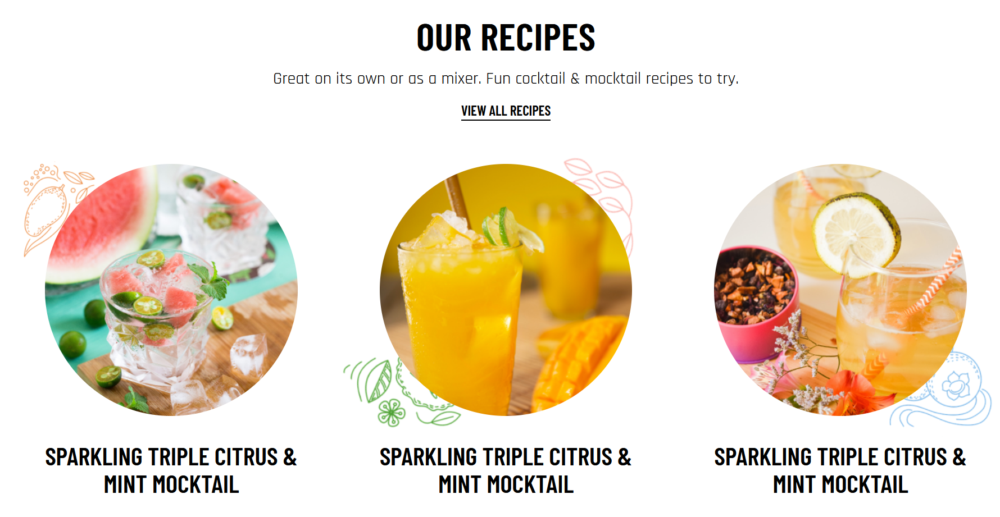

# 📱 Blog Showcase
* Small project consisting of three rounded images and some text
* The project was made by this design on figma: [Blog Showcase](https://www.figma.com/file/8Npy3XVF2Vvt2e6PS8EZiG/Task-2-%2F-LD?node-id=0%3A1)
* The project was built to work well on every device while retaining pixel-perfect design and having added functionality
* implemented SEO

# 👉 Built With
* HTML5
* CSS3

# 💻 Development
1. git clone https://github.com/DanijelAdrinek/Blog-showcase.git
2. run the HTML file in a browser